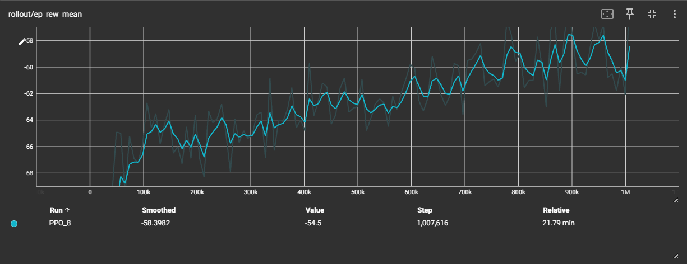

# Warehouse Robot Path Planning (Reinforcement Learning)

This project simulates a warehouse environment where multiple robots must pick up and deliver items to target locations on a grid. The environment is compatible with OpenAI Gymnasium and is designed for reinforcement learning experiments using Stable Baselines3.

## Features
- **Custom Gymnasium environment** simulating a warehouse grid
- **Multiple robots and items** with random pickup and dropoff locations
- **Collision avoidance** and delivery efficiency optimization
- **Reward structure** encourages successful deliveries and penalizes collisions and wasted time
- **Terminal-based rendering** for visualization
- **Training and evaluation** using PPO (Proximal Policy Optimization)
- **TensorBoard logging** for monitoring training progress

## Installation
Install the required Python packages:
```sh
pip install gymnasium stable-baselines3 numpy tensorboard
```

## Usage
### Training
Run the training script:
```sh
python agent.py
```

### Monitoring Training
To monitor training progress with TensorBoard:
```sh
tensorboard --logdir logs
```
Then open [http://localhost:6006](http://localhost:6006) in your browser.

### Testing
To test a trained model and see the environment render in the terminal:
1. Uncomment the `test_sb3` line in `agent.py` and specify the checkpoint (e.g., `test_sb3(100_000)`).
2. Comment out or remove the `train()` call if you only want to test.
3. Run:
```sh
python agent.py
```

## Results
Below is a sample training result visualized in TensorBoard. The graph shows the mean episode reward during training (`rollout/ep_rew_mean`). The clear upward trend demonstrates that the agent is learning to optimize its policy in the warehouse environment over time.



- **Mean episode reward** increases as training progresses, indicating successful learning and improved agent performance.

## Example Output
Below is an example of the warehouse grid rendered in the terminal during an episode:
```
Warehouse:
. . . . . .
. . . . . .
. . I . . .
. . . R . .
. . . . D .
. . . . . .
```
- `R` = Robot
- `C` = Robot carrying an item
- `I` = Item to pick up
- `D` = Delivery location
- `.` = Empty space

## Project Structure
- `warehouse_env.py` — Contains the `WarehouseEnv` environment
- `agent.py` — Training and testing script
- `logs/` — TensorBoard logs
- `models/` — Saved models